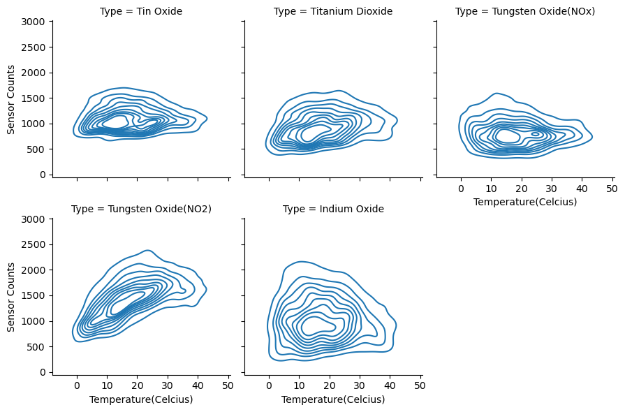
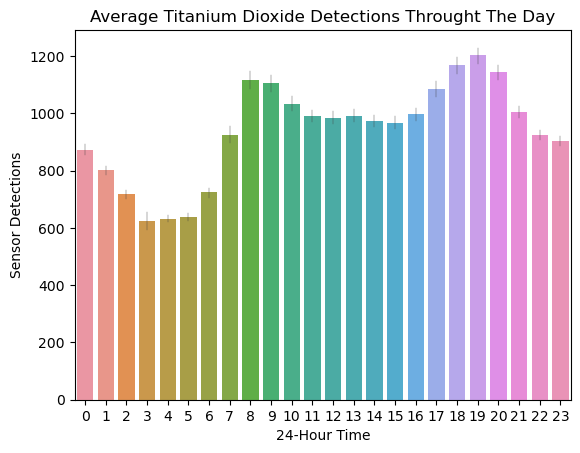
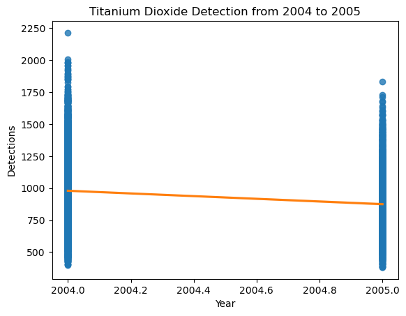
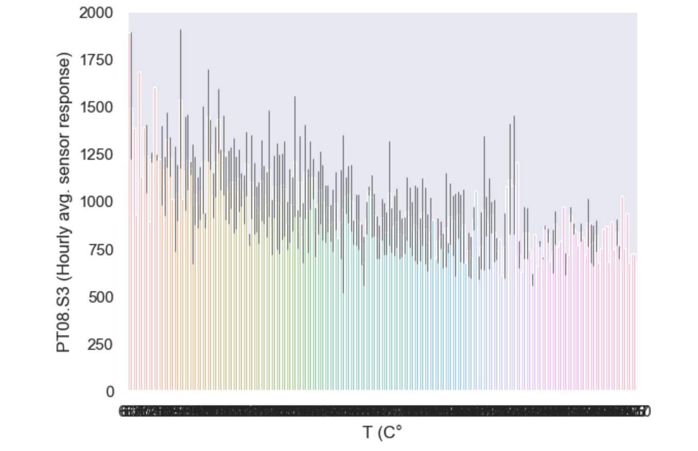
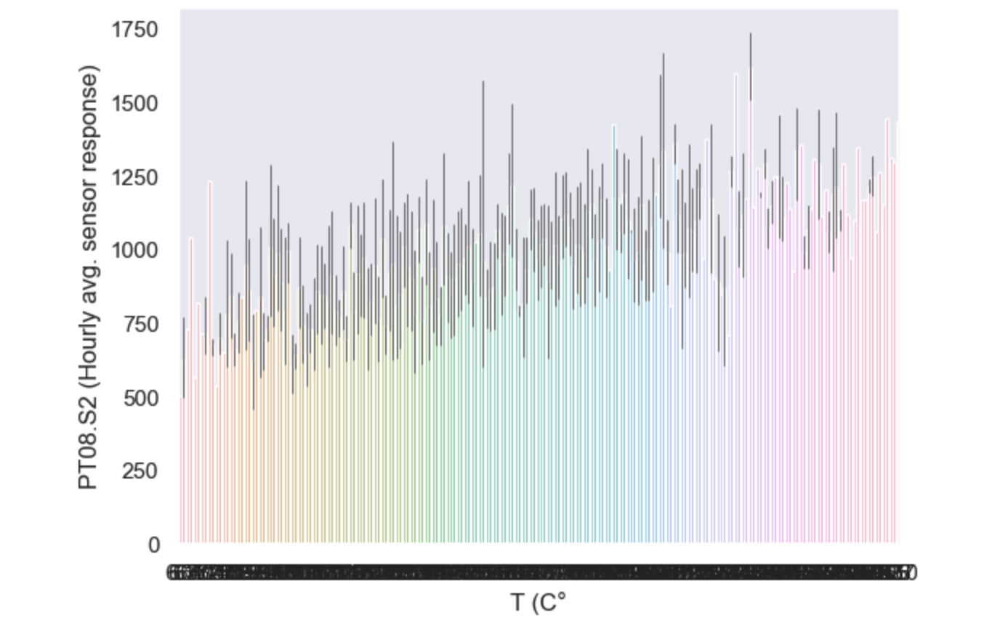

# Analysis

## Preface

In this analysis, we will try to answer the questions we have had regarding our data by manipulating the data to be represented by various parameters and graphs.

## Question (Jayden): Which metal oxides are present at various temperatures and humidities?

Observations:
- mean Temperature 17.965&deg;C
- mean Relative Humidity 48.775%
- mean Absolute Humidity 0.995 gm-3

### Sensor Counts at Various Temperatures

### Sensor Counts at Various Relative Humidities

### Sensor Counts at Various Absolute Humidities

### Conclusions

For the Temperature plots, we see that the majority of detections happen just below the mean temperature. 
We also see an increase in Tungsten Oxide detections as the temperature increases, 
and a decrease in Indium Oxide detections as the temperature increases.  

The Relative Humidity plots show us that Tin Oxide and Tungsten Oxide nominally targeted for Nitrous Oxides are detected mostly below the average.
 Tungsten Oxide when nominally targeted for NO2 is found higher than when targeted for Nitrous Oxides.  
 
 The Absolute Humidity plots show an increase in Tungsten Oxide detections as Absolute Humidity increases.
 
 ## Question: Is there an Increase in Titanium Dioxide detections?
 
 Titanium Dioxide is dangerous to Inhale.  
 Observations:
 
 
 
 
 
 ### Conclusion
 
 There doesn't appear to be any cause for alarm regarding the increase in Titanium Oxide detections as there is no significant change from 2004 to 2005. Titanium Dioxide is detected mostly from 8:00 - 9:00 and 17:00 - 19:00.

## Question 2 (Abhiek): Which elements are highly correlated to temperature?

Observations:
Only three elements are highly correlated to Temperature.
Relative and absolute Humidity is also a good predictor of Temperature.

 ### Conclusion
 The top 3 air pollutants from our dataset that are correlated to temperature are Benzene, Tungsten oxide and Tin oxide
 
 ## Question 3 (Andrew): Is there a high enough concentration of non-metal pollutents to be dangerous.
 
 
 
 
 
 
 
 A concentration of Benzene that qualifies as immediately dangerous to health, according to the CDC, is 1597.34 mg/m^3.

A concentration of NO2 that is expected to have 50% mortality rate is 327.4mg/m^3. However, it is listed that 37.63 mg/m^3 is expected to be mildly irritating.

A concentration of C0 that qualifies as the same is 20mg/m^3.
 
 ### Conclusion
 There is not enough of any of these pollutants in the air to be considered dangerous.
