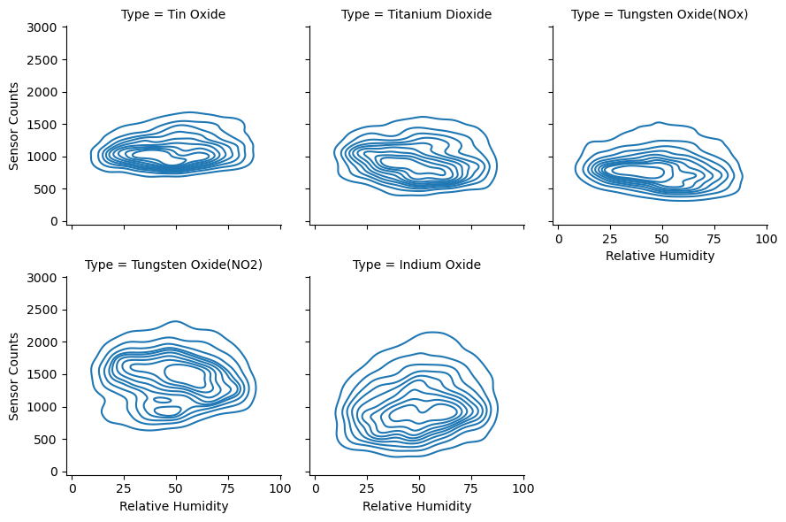
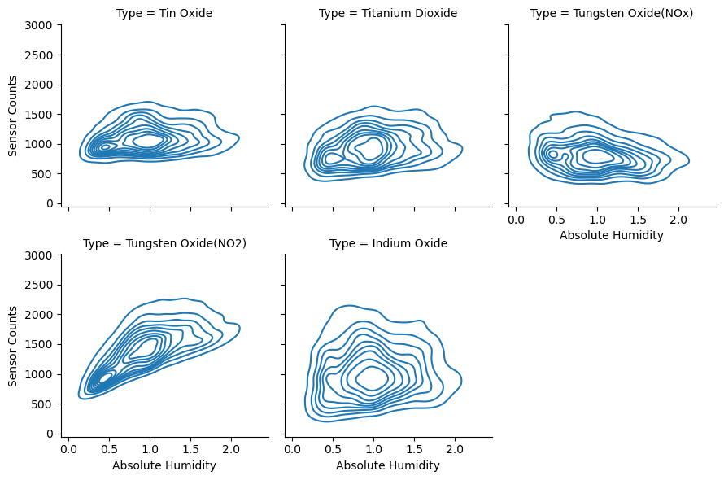

# Analysis

## Preface

In this analysis, we will try to answer the questions we have had regarding our data by manipulating the data 
to be represented by various parameters and graphs.

## Question: Which metal oxides are present at various temperatures and humidities?

Observations:
- mean Temperature to be 17.965&deg;C
- mean Relative Humidity 48.775%
- mean Absolute Humidity 0.995 gm-3

### Sensor Counts at Various Temperatures

### Sensor Counts at Various Relative Humidities

### Sensor Counts at Various Absolute Humidities

### Conclusions

For the Temperature plots, we see that the majority of detections happen just below the mean temperature. 
We also see an increase in Tungsten Oxide detections as the temperature increases, 
and a decrease in Indium Oxide detections as the temperature increases.  

The Relative Humidity plots show us that Tin Oxide and Tungsten Oxide nominally targeted for Nitrous Oxides are detected mostly below the average.
 Tungsten Oxide when nominally targeted for NO2 is found higher than when targeted for Nitrous Oxides.  
 
 The Absolute Humidity plots show an increase in Tungsten Oxide detections as Absolute Humidity increases.
