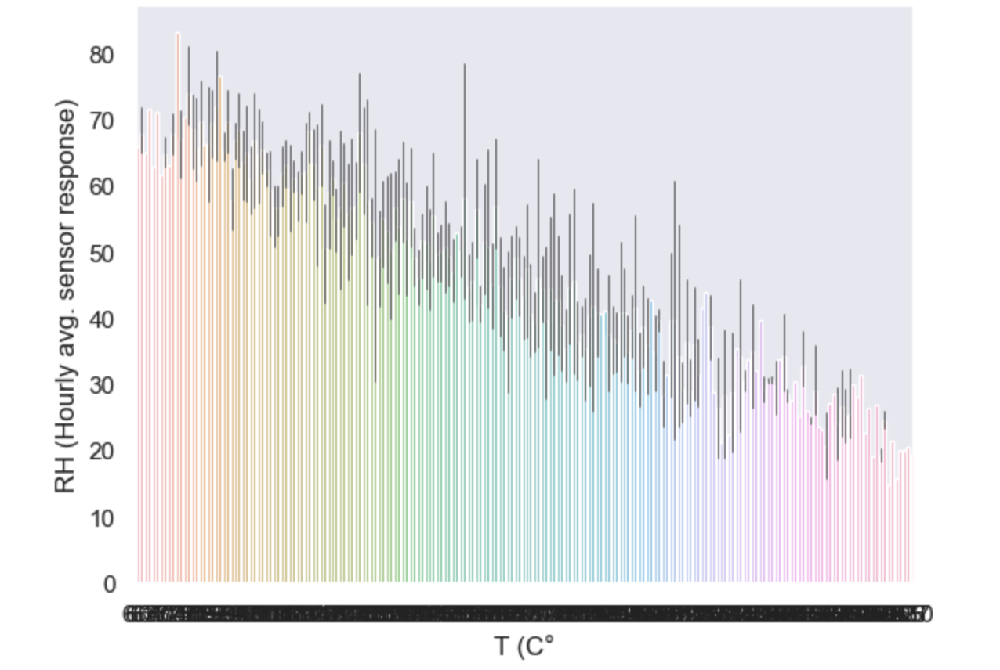
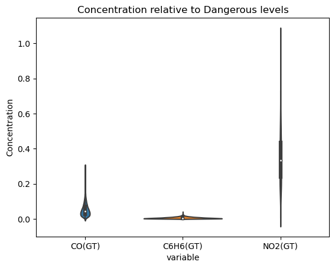

# Analysis

## Preface

In this analysis, we will try to answer the questions we have had regarding our data by manipulating the data to be represented by various parameters and graphs.

## Question (Jayden): Which metal oxides are present at various temperatures and humidities?

Observations:
- mean Temperature 17.965&deg;C
- mean Relative Humidity 48.775%
- mean Absolute Humidity 0.995 gm-3

### Sensor Counts at Various Temperatures

### Sensor Counts at Various Relative Humidities

### Sensor Counts at Various Absolute Humidities

### Conclusions

For the Temperature plots, we see that the majority of detections happen just below the mean temperature. 
We also see an increase in Tungsten Oxide detections as the temperature increases, 
and a decrease in Indium Oxide detections as the temperature increases.  

The Relative Humidity plots show us that Tin Oxide and Tungsten Oxide nominally targeted for Nitrous Oxides are detected mostly below the average.
 Tungsten Oxide when nominally targeted for NO2 is found higher than when targeted for Nitrous Oxides.  
 
 The Absolute Humidity plots show an increase in Tungsten Oxide detections as Absolute Humidity increases.
 
 ## Question: Is there an Increase in Titanium Dioxide detections?
 
 Titanium Dioxide is dangerous to Inhale.  
 Observations:
 
 
 
 
 
 ### Conclusion
 
 There doesn't appear to be any cause for alarm regarding the increase in Titanium Oxide detections as there is no significant change from 2004 to 2005. Titanium Dioxide is detected mostly from 8:00 - 9:00 and 17:00 - 19:00.

## Question 2 (Abhiek): Which elements are highly correlated to temperature?

Observations:
Most metal oxides are weakly correlated to temperature .

This heat map allows us to easily see what variables strongly relate to Temperature

We can see that there is a strong and negative correlation between RH and T

We can see that there is a weak and negative correlation between PTO8_S3 and T

We can see that there is a weak and positive correlation between PTO8_S3 and T

Conclusion:
We can not predict temperature by using metal oxides as no metal oxides show a strong correlation with Temperature (C). However, since Relative Humidity (%) is strongly and inversely related to Temperature. Relative Humidity can be a good predictor of temperature.

 ### Conclusion

 ### Conclusion
 The top 3 air pollutants from our dataset that are correlated to temperature are Benzene, Tungsten oxide and Tin oxide
 
 ## Question 3 (Andrew): Is there a high enough concentration of non-metal pollutents to be dangerous to humans.
 
 In this analysis, we will focus on answering this question. If we find that there is a high enough concentration to be dangerous, we will answer a subsequent question of: When is the pollutent that high?

The levels that I we are considering 'Dangerous' for the purposes of this analysis are listed below:

- A concentration of Benzene (C6H6) that qualifies as immediately dangerous to health, according to the CDC, is 1597.34 mg/m^3.1

- A concentration of NO2 that is expected to have 50% mortality rate is 327.4mg/m^3. However, it is listed that 37.63 mg/m^3 is expected to be mildly irritating.2

- A concentration of C0 that qualifies as immediately dangerous is 20mg/m^3.3

Over the course of the year, the mean values of each non-metal pollutent we're analyzing is:  

- Mean concentration of benzene: 10.08 mg/m^3.
- Mean concentration of NO2: 113.09 mg/m^3.
- Mean concentration of CO: 2.15 mg/m^3.

### Q1: Is there a high enough concentration of these non-metal pollutents to be immediately dangerous to humans.

 

Concentration of each non-metal particulate measured, relative to dangerous levels as described by the CDC. A value of 1 is equal to what is considered dangerous. As we can see the value of NO2 is both the most volatile and the only particle that was recorded at a dangerous level in this timeframe.

### We see that NO2 shows the possibility of having a high enough concentration to be dangerous to humans, therefore we will focus on when and how often was the concentration dangerous.

 

 This shows the days when the concentration of NO2 is considered an irritant, and the days that is imminently dangerous in red.

 

This graph shows the average hourly concentration of NO2 throughout the day. Showing us that peak times are generally at 7pm and 10am.

There are two days in which the peak NO2 concentration breaches the listed dangerous level. This graph shows the average value per hour on specifically those days. We notice that the peak times are around 10am possibly around 4pm. However the margin for error is significantly larger at 4pm.  

# Conclusions

## Question 1: Is there a high enough concentration of non-metal pollutents to be dangerous to humans?

 There is no expected dangerous days for either C6H6 (Benzene) or CO (Carbon Monoxide) concentration. There is data to show that concentrations of NO2 (Nitrogen Dioxide) are high enough to be irritating, and dangerous on rare days.

## Question 2: When and how frequently are levels of NO2 considered dangerous?

 It is quite frequent to have a concentration of NO2 that is considered an irritant. So much so that average values throughout the year at any point in the day exceed levels that are considered irritating.  

 On top of that there are two days throughout the year that was recorded where the concentration of NO2 was high enough to be considered dangerous. Interestingly, both days were later in the year: 03/02/2005 and 11/02/2005 (the year recorded went from 10/03/2004 to 04/04/2005). Possibly suggesting an increase over time. In order to check that we would need follow up data from a later year. On those days the time of day with the highest concentration was approximately 10am. However, when considering the whole year, there were two peak times of day, which were 10am and the higher peak at 7pm.2

### References:

1: [C6H6 CDC info](https://www.cdc.gov/niosh/idlh/71432.html)

2: [NO2 CDC info](https://www.cdc.gov/niosh/idlh/10102440.html)

3: [CO CDC info](https://www.cdc.gov/niosh/idlh/630080.html)
